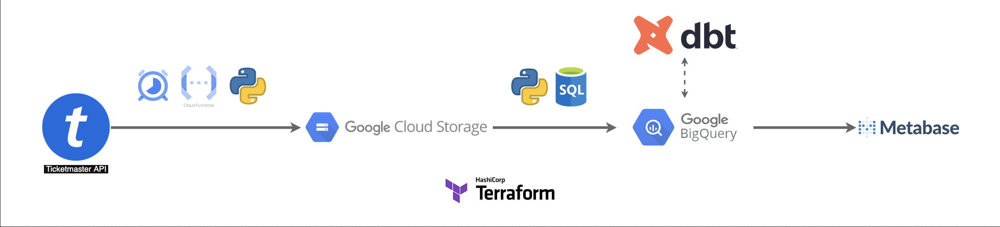
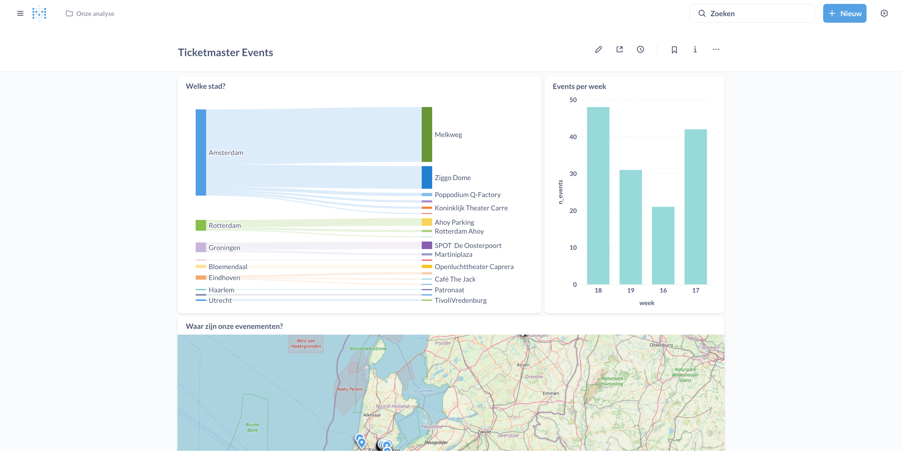

# Ticketmaster Event Extracter

This project is designed to extract event data from the Ticketmaster API, transform it, and load it into Google Cloud Storage (GCS) and BigQuery. The pipeline is orchestrated on a daily basis using a Google Cloud Schedule. The data is then visualized using Metabase. The project is part of the [Data Engineering Zoomcamp](https://github.com/DataTalksClub/data-engineering-zoomcamp/tree/main) hosted by [Alexey Grigorev](https://alexeygrigorev.com/), a free nine-week course to learn more about the data engineering fundamentals.

## Table of Contents
- [Project Overview](#project-overview)
    - [Problem Statement](#problem-statement)
    - [High-Level Architecture](#high-level-architecture)
    - [Project Structure](#project-structure)
    - [Technologies Used](#technologies-used)
- [Setup Instructions](#setup-instructions)
- [Repo Structure](#repo-structure)
- [References](#references)
- [License](#license)

## Project Overview

### Problem Statement

The problem this project aims to solve is the need for a reliable and efficient way to extract, transform, and load event data from the [Ticketmaster API](https://developer.ticketmaster.com/api-explorer/v2/) into a data warehouse for analysis and visualization. In particular, we use the Event Search endpoint of the Discovery API v2 to get information about the events that are happening in the next 30 days in the Netherlands. The API provides a wealth of information but accessing and processing this data can be challenging. This project automates the process of extracting data from the API, transforming it into a suitable format, and loading it into Google Cloud Storage and BigQuery for further analysis. At the end of the project we will be able to analyse the data and find answers to questions like:
- How many events are happening in the Netherlands in the next 30 days?
- What are the most popular venues for events?
- What are the most popular event types?

### High-Level Architecture
The high-level architecture of the project is depicted below. The data pipeline consists of several components that work together to extract, transform, and load data from the Ticketmaster API to Google Cloud Storage and BigQuery. The pipeline is orchestrated using Google Cloud Scheduler, which triggers the data extraction and loading tasks on a daily basis. The extracted data is stored in Google Cloud Storage, and then transformed into a dimensional model using DBT. Finally, the transformed data is visualized using Metabase. 



### Project Structure
The project is structured into several directories, each serving a specific purpose:

```
/ticketmaster-de-pipeline
│
├── /terraform              # Directory for Terraform configuration files
│   ├── main.tf             # Main configuration file for Terraform
│   ├── variables.tf        # Variables used within Terraform configurations
│   └── README.md           # Documentation for setting up infrastructure
│
├── /src                    # Source code directory
│   ├── extract_data.py     # Script to extract data from Ticketmaster API
│   ├── load_to_gcp.py      # Script to load data into Google Cloud storage
│   ├── load_to_bq.py       # Script to load data from storage to BigQuery
│   ├── main.py             # Script to orchestrate the data pipeline
│   ├── requirements.txt    # Python dependencies for the project
│   └── __init__.py         # Python package file
│
├── /dbt                    # DBT project for data transformations
│   ├── models/             # Directory for DBT models  
│   │   ├── dim_event.sql   # Dimensional table for events
│   │   ├── dim_venue.sql   # Dimensional table for venues
│   │   └── fct_events.sql  # Fact table for events
│   ├── dbt_project.yml     # Project configurations
│   └── profiles.yml        # Connection profiles (for BigQuery)
│
├── /dashboard              # Directory for Metabase dashboard configurations
│   └── compose.yml         # Docker Compose file for running Metabase
│
├── .gitignore              # File specifying files to ignore in version control
└── README.md               # Main documentation for project overview, setup, and usage
```

### Technologies Used
- **Python**: The primary programming language used for data extraction and transformation.
- **Docker**: Used to create a containerized environment for the project.
- **Terraform**: Infrastructure as Code (IaC) tool used to provision and manage cloud resources.
- **Google Cloud Platform (GCP)**: The cloud provider used for hosting the data pipeline.
  - **Google Cloud Storage (GCS)**: Used for storing the raw extracted data.
  - **BigQuery**: Used for data warehousing and analytics.
  - **Cloud Run functions**: Used to run the data extraction and loading tasks written in Python. 
  - **Cloud Scheduler**: Used to schedule the data extraction and loading tasks.
- **Dbt**: Used to transform the raw data into a dimensional model and load it into BigQuery.
- **Metabase**: An open-source business intelligence tool used for data visualization and exploration.

## Setup Instructions

### Prerequisites:
- API key for Ticketmaster
- Python 3.11 or higher
- Docker Desktop
- Google Cloud SDK
- Terraform
- Git
- Metabase (optional for visualization)
- DBT

#### Obtaining a Ticketmaster API Key
- Go to the [Ticketmaster Developer Portal](https://developer.ticketmaster.com/products-and-docs/apis/getting-started/)
- Sign up for an account if you don't have one.
- Create a new application and obtain your API key (Consumer Key).
    - The project uses the Event Search endpoint of the Discovery API v2
- Make sure to keep your API key secure and do not share it publicly.
- Replace `your_api_key_here` with your actual API key in the `main.tf` file.

### Steps to reproduce the project

#### 1. **Clone the Repository**: 
```bash
git clone https://github.com/larsvasseldonk/ticketmaster-de-pipeline.git
cd ticketmaster-de-pipeline
```
#### 2. **Authenticate your Google Cloud account**
- Make sure you have the Google Cloud SDK installed
- Run `gcloud init` to initialize or reinitialize gcloud 
- Run `gcloud auth login` to authenticate your Google Cloud account
- Enable the following APIs:
    - BigQuery API
    - Cloud Run API
    - Cloud Storage API
    - Cloud Scheduler API
 
#### 3. **Build the infastructure with Terraform**:
- Make sure you have Terraform installed:
    - For Mac users, use: `brew install terraform`
- Navigate to the `terraform` directory: `cd terraform`
- Update the `project_id` variable in `variables.tf`
- Initialize Terraform: `terraform init`
- Plan the infrastructure: `terraform plan`
- Apply the infrastructure: `terraform apply`

After following these steps, your GCP project should contain the following resources:
- A Cloud Run service for the data extraction and loading tasks.
- A Cloud Storage bucket for storing the raw extracted data.
- A BigQuery dataset for storing the transformed data.
- A Cloud Scheduler job for scheduling the data extraction and loading tasks. This job will run daily at 00:00 UTC.

#### 4. **Run the data pipeline**:
You can manually trigger the Cloud Run service by sending a POST request to the service URL. The URL can be found in the GCP Console under "Cloud Run". After doing this, you should see the raw data in the GCS bucket in the `archive` folder. When it is in the `archive` folder it means the data is successfully loaded into the BigQuery dataset. In BigQuery you can find the data in the `ticketmaster` dataset under the `stg_hist_events` table. In this table Slowly Changing Dimensions (SCD) type 2 are used to keep track of the changes in the data. To only keep the latest version of the data, make sure to set `is_current` to `true` in the `stg_hist_events` table.

#### 5. **Run DBT to transform the data into a dimensional model**:
- Make sure you have DBT installed and configured.
    - Install DBT with the BigQuery adapter:
```bash
pip install dbt-bigquery
```
- Navigate to the `dbt` directory: `cd dbt`
- Update the `profiles.yml` file with your BigQuery credentials.
- Run `dbt deps` to install the required dependencies.
- (Optional) Run `dbt debug` to check if the connection to BigQuery is working.
- Run DBT to build the models: `dbt run`
- To test the models, run: `dbt test`
- When completed successfully, the following tables are created in BigQuery:
    - `dim_event`: Dimensional table for events
    - `dim_venue`: Dimensional table for venues
    - `fct_events`: Fact table for events

#### 5. **Visualize data with MetaBase**:
- Install Metabase using Docker:
    - Navigate to the `dashboard` directory: `cd dashboard`
    - Build the Docker image with docker-compose: `docker-compose build`
    - Run the Docker container: `docker-compose up -d`
- Open your browser and go to `http://localhost:3000`.
- Follow the setup instructions to connect to your BigQuery dataset.
- Create a new dashboard and add two new visualizations:

__A [sankey chart](https://en.wikipedia.org/wiki/Sankey_diagram) that shows in which city and venue the events are happening:__
```sql
SELECT
    dv.venue,
    dv.city,
    count(*) AS n_events
FROM ticketmaster_dataset_n.fct_events fe
LEFT JOIN ticketmaster_dataset_n.dim_event de ON fe.event_sk = de.event_sk
LEFT JOIN ticketmaster_dataset_n.dim_venue dv ON fe.venue_sk = dv.venue_sk
WHERE venue != ''
GROUP BY ALL
```

__A line chart that shows the distribution of the events across weeks:__
```sql
SELECT 
    EXTRACT(WEEK FROM date) AS week,
    COUNT(*) AS n_events
FROM ticketmaster_dataset_n.fct_events fe
LEFT JOIN ticketmaster_dataset_n.dim_event de ON fe.event_sk = de.event_sk
LEFT JOIN ticketmaster_dataset_n.dim_venue dv ON fe.venue_sk = dv.venue_sk
GROUP BY ALL
```

A screenshot of my dashboard is shown below. You can use this as a reference to create your own dashboard.



#### 6. **Remove the resources**

After you are done with the project, you can remove the resources to avoid unnecessary costs. You can do this by running the following commands:
- To stop the Metabase container, run: `docker-compose down`
- To remove the Metabase container and all its data, run: `docker-compose down -v`
- To remove all the Google Cloud resources created by Terraform, run: `terraform destroy`

## Next Steps

To improve this project, the following steps can be taken:
- Extract more information from the API request to enrich the dataseet.
- Schedule the DBT jobs to run automatically after the data is loaded into BigQuery.
- Deploy the Metabase dashboard to a cloud service for easier access.
- Add the API key to a secret manager for better security.